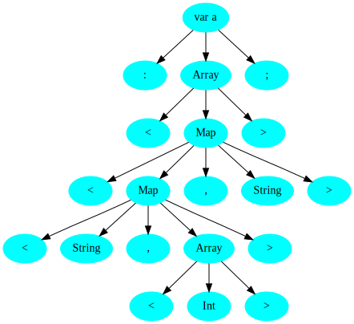

## Грамматика

```
S -> var VARIABLE: T;
T -> Array<R>
R -> Int | String
R -> Map<R, R>
R -> T
VARIABLE = [a-zA-Z_][a-zA-Z_0-9]*
```
В грамматике изначально нет левой рекурсии. Можно переходить к следующему шагу.

## Лексический анализатор

<table class="black">
<tbody>
    <tr>
        <th>Терминал</th>
        <th>Токен</th>
    </tr>
    <tr>
        <th>var</th>
        <th>VAR</th>
    </tr>
    <tr>
        <th>variable name</th>
        <th>VARIABLE</th>
    </tr>
    <tr>
        <th>:</th>
        <th>COLON</th>
    </tr>
    <tr>
        <th>Array</th>
        <th>ARR</th>
    </tr>
    <tr>
        <th><</th>
        <th>L_ANGLE_BRACKET</th>
    </tr>
    <tr>
        <th>></th>
        <th>R_ANGLE_BRACKET</th>
    </tr>
    <tr>
        <th>Map</th>
        <th>MAP</th>
    </tr>
    <tr>
        <th>Int</th>
        <th>INT</th>
    </tr>
    <tr>
        <th>String</th>
        <th>STRING</th>
    </tr>
    <tr>
        <th>,</th>
        <th>COMMA</th>
    </tr>
    <tr>
        <th>;</th>
        <th>SEMICOLON</th>
    </tr>
</tbody>
</table>

## Синтаксический анализатор

<table class="black">
<tbody>
    <tr>
        <th>Нетерминал</th>
        <th>FIRST</th>
        <th>FOLLOW</th>
    </tr>
    <tr>
        <th>S</th>
        <th>var</th>
        <th>;</th>
    </tr>
    <tr>
        <th>T</th>
        <th>Array<</th>
        <th>></th>
    </tr>
    <tr>
        <th>R</th>
        <th>Int, String, Array<, Map<</th>
        <th>eps, ></th>
    </tr>
</tbody>
</table>

## Визуализация дерева разбора

На примере выражения `var a: Array<Map<Map<String, Array<Int>>, String>>;`:


